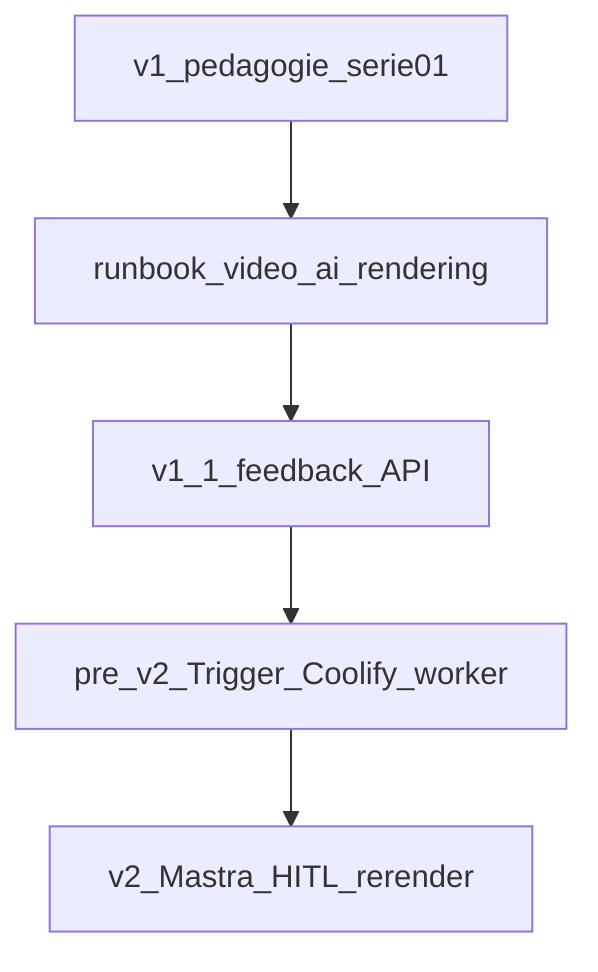

# Video-AI — Roadmap & état des lieux

**Emplacement** : racine `KM/Docs`, fichier **`02-…`** — suite logique de [`01-index`](01-index.md) pour **où en est le plan** sans ouvrir l’index.

**Objectif** : vue **dev** complète — **cases à cocher**, **suites de versions**, **ordre de priorité** aligné sur les décisions **Trigger.dev v4** ([orchestrateur](./reference/video-ai-orchestrator-decision.md)) et **Mastra / OpenClaw** ([couches supérieures](./reference/video-ai-upper-layers-mastra-openclaw.md), [mental model](./reference/video-ai-upper-layers-mastra-openclaw.md#mental-model-orchestrateur-agents), [escalade agentique](./reference/video-ai-upper-layers-mastra-openclaw.md#progressive-agent-capabilities)).  
**À mettre à jour** après chaque jalon : cocher/décocher, bump `updated`.

## Légende

| Symbole | Signification |
|---------|----------------|
| `[x]` | **Livré** dans le dépôt (code ou doc présent, utilisable). |
| `[ ]` | **Pas fait** ou absent du repo. |
| *Partiel* | Sous-points : ce qui manque pour fermer le volet. |

*Les chemins sont relatifs à la racine du monorepo `Video-AI/` sauf mention `KM/Docs/`.*

### Niveaux de maturité (lire les statuts)

Pour éviter qu’un « livré » signifie à la fois **doc** et **prod validée**, distinguer :

| Niveau | Signification (exemples) |
|--------|---------------------------|
| **1 — Infra / doc** | Runbooks, ADR, workspace `apps/trigger`, doc self-host Coolify, contrats API. |
| **2 — Orchestration** | Tasks Trigger enchaînées, `POST /jobs/render-pipeline`, retries / observabilité — y compris chaîne avec **stub** à une étape. |
| **3 — Rendu worker validé hors stub** | Chrome + FFmpeg (ou équivalent) exécutent un **vrai** rendu (pas seulement log / placeholder) ; l’**environnement** exact (image worker, prod, etc.) est figé dans le runbook — ce niveau est **indépendant** du libellé « local » vs « distant ». |

Un runbook ou un POC peut être **niveau 1–2 livré** alors que le **niveau 3** est encore **partiel** : le dire explicitement dans la synthèse et les cases.

---

## Cartographie doc (ne pas dupliquer ailleurs)

| Document | Rôle |
|----------|------|
| [video-ai-vision](./explanation/video-ai-vision.md) | **Pourquoi** et trajectoire **v1 / v2 / v3**. |
| [video-lifecycle](./reference/video-lifecycle.md) | **Séquence** canonique ; [index visuel modulaire](./reference/video-lifecycle.md#architecture-and-flows-visual-index) (auteur / exécution / produit) ; [§ Platform roadmap v1.1](./reference/video-lifecycle.md#platform-roadmap-v11-feedback). |
| [workflow-tools-synthesis](./research/workflow-tools-synthesis.md) | **Inngest / Trigger.dev / Mastra / OpenClaw** — rôles, **ordre d’intégration** (§3). |
| [video-ai-orchestrator-decision](./reference/video-ai-orchestrator-decision.md) | **Décision** : **Trigger.dev v4** vs Inngest + spike **Coolify** (réseau Docker, registry). |
| [video-ai-upper-layers-mastra-openclaw](./reference/video-ai-upper-layers-mastra-openclaw.md) | **Mastra** (LLM dans tasks Trigger) + **OpenClaw** (poste auteur), HITL, ordre v1.1 → v2. **Mental model** : [§ dédié](./reference/video-ai-upper-layers-mastra-openclaw.md#mental-model-orchestrateur-agents). **Escalade des droits agent** (doctrine, pas avancement) : [§ 2026](./reference/video-ai-upper-layers-mastra-openclaw.md#progressive-agent-capabilities). |
| [video-ai-preparation](./video-ai-preparation/video-ai-preparation.md) | Formats, template pilot, **avant** code. |
| [serie-01-git-github](./video-ai-preparation/serie-01-git-github.md) | **Ordre** des clips série 01 + liens outlines. |
| [video-ai-development](./runbooks/video-ai-development.md) | Workflow quotidien, Studio, qualité. |
| [remotion](./runbooks/remotion.md) · [api](./runbooks/api.md) · [frontend](./runbooks/frontend.md) · [postgres-local](./runbooks/postgres-local.md) | Procédures par couche. |
| [deploy-selfhost-api-frontend](./runbooks/deploy-selfhost-api-frontend.md) | Docker / Coolify / VPS. |
| [soul-recherche-visuelle](./research/soul-recherche-visuelle.md) · [git-github-vulgarisation-visuelle](./research/git-github-vulgarisation-visuelle.md) | Recherche visuelle / vulgarisation. |
| [solarpunk-theme-decisions](./reference/solarpunk-theme-decisions.md) · [thp-solarpunk-visual-checklist](./Templates/thp-solarpunk-visual-checklist.md) · [da-thp-synthese](./reference/da-thp-synthese.md) | **DA THP** normative + QA visuelle + **synthèse 1 page** (4 règles, liens, inventaire, étalon) — voir [§ DA → étalon → Trigger → Mastra](#da-etalon-orchestration-ia). |

---

## Synthèse par phase (vision produit)

| Phase | Cible | Statut dev (résumé) |
|-------|--------|---------------------|
| **v1** | Vidéos Remotion, équipe autonome, rendu manuel/CLI, monorepo stable | **~75–85 %** — cœur livré ; série 01 incomplète ; runbook [video-ai-rendering](./runbooks/video-ai-rendering.md) **livré** (niveau 1 doc + pratique local/CLI) ; **rendu worker distant** = sujet **pré-v2** ; **pas de CI** sur le monorepo racine. |
| **v1.1** | Catalogue + **feedback** (threads, commentaires timecodés) | **Schéma DB + API lecture vidéos** ; **pas** d’API commentaires ni UI feedback. |
| **Pré-v2** | Runbook rendu distant + **POC** orchestrateur | **Sans couche agentique** ; **Trigger est déjà utile sans IA** pour verrouiller les **workflows durables** (enchaînement d’étapes, retries, observabilité) — ce n’est pas « seulement » de la doc d’infra. [Décision Trigger v4](./reference/video-ai-orchestrator-decision.md) ; runbook rendering livré ; POC orchestration minimal (deps, tasks **stub** + API) ; **niveau 3** (rendu worker **validé hors stub**) **encore à finaliser**. |
| **v2** | Boucle feedback → IA → re-render | **Règle** : **Mastra = étape** (`task` → agent), **jamais** parallèle. **OpenClaw** : poste auteur (pas prod / pas config Trigger — [§ C](./reference/video-ai-upper-layers-mastra-openclaw.md#c-openclaw--poste-auteur)). **Doc** : [couches supérieures](./reference/video-ai-upper-layers-mastra-openclaw.md) (HITL) ; **zéro impl** pipeline feedback→IA. |
| **v3** | Régénération guidée | Vision uniquement. |

**Doctrine agentique (pas un doublon de ce tableau)** : cette page = **avancement** (phases, priorités, cases). L’**escalade des droits** agent (read-only → diff → writer), le **refus du big-bang prod** Trigger + Mastra + écriture repo, et le palier **Trigger seul sans agent autonome** sont détaillés dans [couches supérieures — § Escalade des capacités agent (2026)](./reference/video-ai-upper-layers-mastra-openclaw.md#progressive-agent-capabilities) ; **ne pas fusionner** les deux documents — la roadmap **renvoie** vers la doctrine sans la recopier.

---

## Direction artistique → étalon → Trigger → Mastra (ordre recommandé 2026) {#da-etalon-orchestration-ia}

**Constat** : le repo a déjà **runbooks, skills, templates, décisions Solarpunk** et un IDE (Cursor) pour exécuter. **Trigger** sert surtout les **workflows longs** (checkpoint / resume, retries, orchestration de rendu) ; **Mastra** apporte surtout **mémoire et orchestration agentique** dans une étape de pipeline — **ni l’un ni l’autre ne règlent une DA floue**. Sans cadre visuel clair, ils **industrialisent** ou **amplifient** plutôt qu’ils ne corrigent le style.

**Ordre net** (à respecter avant d’accélérer la prod « à grande échelle ») :

| Étape | Cible | Rôle |
|-------|--------|------|
| **A — Cadre DA** | **Livré** : [da-thp-synthese](./reference/da-thp-synthese.md) (~1 page) — **4 règles non négociables** + liens canoniques + politique Storybook + inventaire — **sans** recopier les longs documents. Complète : [solarpunk-theme-decisions](./reference/solarpunk-theme-decisions.md), [Templates/pilot-outline](./Templates/pilot-outline.md), [checklist Solarpunk](./Templates/thp-solarpunk-visual-checklist.md), skill [thp-video-generation](../../packages/skills/thp-video-generation/SKILL.md), rules [remotion-best-practices](../../packages/skills/remotion-best-practices/rules/), [Soul — recherche visuelle](./research/soul-recherche-visuelle.md). |
| **B — Étalon** | **Motion** : **DemoShowcaseSolarpunk** = étalon **unifié** (kit + patterns), **sans** faux cours pour tout caser — détail [da-thp-synthese — Reference clip](./reference/da-thp-synthese.md#reference-clip-current). **Pédagogique (B2)** : composition dédiée **seulement si** il faut valider hero/secondaire + rythme sur un **vrai** mini-cours (ex. Serie01). Objectif long terme : **point de comparaison** pour toute la série. |
| **C — Trigger** | **Après A + B** : fiabiliser **exécution, rendu, répétabilité** ([décision orchestrateur](./reference/video-ai-orchestrator-decision.md), [inventaire render pipeline](./reference/trigger-prepare-render-fields-inventory.md)). Si A + B sont insuffisants, Trigger peut **accélérer des rendus encore faibles** visuellement. |
| **D — Mastra** | **Après** un cycle **contenu → rendu → feedback** défendable : assistance, suggestions, mémoire — [couches supérieures](./reference/video-ai-upper-layers-mastra-openclaw.md). **Accélérateur**, pas arbitre de goût. |

**Outil d’exécution** : **Cursor** (et la chaîne doc existante) reste le levier principal pour A et B ; Trigger / Mastra viennent **ensuite**.

**Lecture conjointe** avec le tableau **Ordre de priorité global** ci‑dessous : si la **DA n’est pas cadrée** (A + B), interpréter les lignes **série 01** et **pré‑v2 / Trigger** avec prudence — l’**industrialisation** ne remplace pas l’**intention visuelle**.

---

## Ordre de priorité global (ce qu’on fait avant quoi)

*Ordre validé pour enchaîner sans sur-ingénierie : rendu et données feedback avant IA lourde. **Méta-ordre DA / étalon** : voir [§ précédent](#da-etalon-orchestration-ia) — ne pas utiliser Trigger ou Mastra pour « réparer » une DA non figée.*

| # | Priorité | Pourquoi |
|---|----------|----------|
| **1** | **Série 01 pédagogie** (outlines + comps **05+**) | Finir le cœur **v1** métier avant d’industrialiser le rendu. |
| **2** | **Runbook** [`video-ai-rendering.md`](./runbooks/video-ai-rendering.md) | Contrat d’équipe sur `remotion render` (local → artefact → stockage) ; **prérequis honnête** avant pré-v2. |
| **3** | **CI minimale** (racine monorepo) | Optionnel en parallèle du 1–2 ; sécurise les PR avant d’ajouter Trigger. |
| **4** | **v1.1 feedback** (API + contrats + UI + auth/modération) | Données réelles de feedback → base pour toute analyse LLM ; **Mastra peu pertinent avant** (cf. [couches supérieures](./reference/video-ai-upper-layers-mastra-openclaw.md#e-ordre-dintroduction)). |
| **5** | **Pré-v2 — Trigger.dev v4** | **Trigger self-host** : workflows durables utiles **sans IA** ; chemin de rendu jusqu’au **niveau 3** (validé **hors stub**). Spike **Coolify** (`DOCKER_RUNNER_NETWORKS`, registry, ports) puis deps, chaîne tasks — [décision](./reference/video-ai-orchestrator-decision.md). **Pas de Mastra** au POC orchestration. |
| **6** | **Runbook OpenClaw** [`openclaw-permissions.md`](./runbooks/openclaw-permissions.md) | **Poste auteur local**, périmètre limité — **pas** d’accès direct **prod** ni à la **configuration des workflows Trigger** ; formaliser permissions ; peut démarrer **en parallèle** des phases 1–4. |
| **7** | **v2** | Task pipeline feedback → (LLM direct puis **Mastra** **dans** une task Trigger si besoin mémoire/multi-agents) → **HITL** Trigger → re-render — [plan POC 5 étapes](./reference/video-ai-upper-layers-mastra-openclaw.md#e-ordre-dintroduction). |

**Chemin critique** (simplifié) :

*En parallèle du chemin critique* : **CI** monorepo (dès que possible) ; runbook **OpenClaw** (poste auteur local, jamais socle prod central).

---

## Documentation — flux visuel et navigation (2026) {#doc-flux-visuel-navigation-2026}

**Progression** : **Mermaid global modulaire d’abord** — carte canonique dans [video-lifecycle — Architecture and flows (visual index)](./reference/video-lifecycle.md#architecture-and-flows-visual-index), renvois depuis les runbooks ([video-ai-development](./runbooks/video-ai-development.md)) — puis **front Vite / React Router** seulement si un besoin **réel** de navigation documentaire (parcours lifecycle, runbooks, états) apparaît. La doc Markdown + Mermaid reste la source de vérité ; une app de lecture éventuelle **ne la remplace pas**.

- **Priorité 1 — Mermaid** : index à trois intentions (auteur / exécution / produit) ; alignement équipe et agents **sans** recopier les procédures opérationnelles.
- **Priorité 2 — Vite (optionnel)** : après stabilisation du modèle visuel dans la doc ; périmètre **minimal** (navigation + pages de lecture) ; **pas** une réécriture du produit THP. Si une app existe : [video-lifecycle — index visuel](./reference/video-lifecycle.md#architecture-and-flows-visual-index) reste la **carte canonique** ; l’app = confort de navigation, pas nouvelle source de vérité sur le flux.
- **Rôles distincts** : **Storybook** = composants UI réutilisables (`@repo/ui`) ; **Trigger** = orchestration de rendu ; ni l’un ni l’autre ne joue le rôle d’un portail documentaire global.
- **Anti-pattern** : lancer **Mermaid + doc-app Vite** comme **un seul** chantier prioritaire (double charge, dette maintenance).

---

## v1 — état détaillé (checklist dev)

### Direction artistique & clip étalon (gageure visuelle)

- [x] **DA THP — synthèse** (~1 page, **4** règles non négociables + liens canoniques + inventaire + étalon) — [da-thp-synthese](./reference/da-thp-synthese.md) ; cadre : [§ DA → étalon → Trigger → Mastra](#da-etalon-orchestration-ia).
- [x] **Clip étalon** : **motion** = **DemoShowcaseSolarpunk** (`DemoShowcaseSolarpunk`) — [da-thp-synthese — Reference clip](./reference/da-thp-synthese.md#reference-clip-current). **Pédagogique sur leçon réelle** : **Pilot 01 V1** (refonte structurée, durée unifiée `PILOT01_DURATION_FRAMES`, outline [§ V1](./video-ai-preparation/pilot-01-prerequis-outline.md#version-v1--refonte-visuelle-étalon-pédagogique-série-01)) ; composition **B2** séparée seulement si un autre mini-cours est nécessaire au-delà de ce pilote.

### Monorepo, tooling, déploiement doc

- [x] Turborepo, workspaces `apps/*`, `packages/*`
- [x] Bun, Biome, TypeScript partagé (`@repo/typescript-config`, `@repo/eslint-config`)
- [x] Runbooks : [monorepo](./runbooks/monorepo.md), [bun-biome](./runbooks/bun-biome.md), [dependencies-submodules](./runbooks/dependencies-submodules.md)
- [x] [deploy-selfhost-api-frontend](./runbooks/deploy-selfhost-api-frontend.md) (Dockerfiles `apps/*`)
- [ ] **CI/CD sur le repo Video-AI racine** (pas de `.github/workflows` dédiés au monorepo ; workflows présents sous `KM/Course/*` uniquement)
- [x] Runbook [video-ai-rendering](./runbooks/video-ai-rendering.md) (local → artefact → runtime worker / Trigger)

### Apps Remotion

- [x] `apps/remotion` — Studio, compositions démos (`TextDemo`, `CodeDemo`, …) enregistrées dans [`Root.tsx`](../../apps/remotion/src/remotion/Root.tsx)
- [x] **Série 01** — shell partagé [`Serie01SceneShell.tsx`](../../apps/remotion/src/remotion/compositions/serie-01/Serie01SceneShell.tsx)
- [x] Pilotes **01–04** : composants + `Composition` dans `Root.tsx` (`Pilot01Prerequis` … `Pilot04Branch`)
- [ ] Pilotes **05–08** (Merge, PR, Fork, git diff optionnel) — ni outlines KM ni comps — voir [serie-01-git-github](./video-ai-preparation/serie-01-git-github.md)

### Bibliothèque UI / Remotion

- [x] `@repo/ui` (dont couche Remotion) — Storybook `apps/storybook`
- [x] `@repo/remotion-lib` — blocs réutilisables (couverture **partielle** ; enrichissement continu)
- [x] Skills agent : `thp-video-generation`, `thp-solarpunk-visual`, `remotion-best-practices` (voir [01-index § skills](./01-index.md#agent-skills-versioned-in-repo))

### Préparation contenu (KM)

- [x] [video-ai-preparation](./video-ai-preparation/video-ai-preparation.md) — formats, template, shortlist
- [x] Outlines série 01 : `pilot-01` … `pilot-04` dans `KM/Docs/video-ai-preparation/`
- [ ] Outlines **pilot-05+** (Merge, …) — *prochaine étape doc* : [serie-01-git-github § Prochaine](./video-ai-preparation/serie-01-git-github.md#prochaine-étape)

### Recherche & méthode (non bloquant v1)

- [x] [soul-recherche-visuelle](./research/soul-recherche-visuelle.md), [git-github-vulgarisation-visuelle](./research/git-github-vulgarisation-visuelle.md)
- [x] Fiches outils v2+ : [inngest](./research/inngest.md), [trigger-dev](./research/trigger-dev.md), [mastra](./research/mastra.md), [openclaw](./research/openclaw.md) + [synthèse](./research/workflow-tools-synthesis.md)
- [x] **Décisions architecture** : [orchestrateur Trigger.dev v4](./reference/video-ai-orchestrator-decision.md), [Mastra + OpenClaw](./reference/video-ai-upper-layers-mastra-openclaw.md) (impl code **pas** requise pour cocher cette ligne)

### Plateforme catalogue (API + frontend + DB)

- [x] **Schéma** [`packages/db/src/schema.ts`](../../packages/db/src/schema.ts) : `videos`, `video_versions`, `feedback_threads`, `feedback_comments` (dont `timestamp_seconds` pour timecode)
- [x] Migrations Drizzle + seed + [postgres-local](./runbooks/postgres-local.md)
- [x] API Hono [`apps/api/src/routes/videos.ts`](../../apps/api/src/routes/videos.ts) : `GET /videos`, `GET /videos/:slug` + contrats `@repo/contracts`
- [x] Tests minimaux API ([`apps/api/test/routes.test.ts`](../../apps/api/test/routes.test.ts))
- [x] Frontend Vite : liste + détail vidéo, [`sceneRegistry`](../../apps/frontend/src/sceneRegistry.tsx) pour lecteur / métadonnées par `compositionId`
- [ ] **Intégration produit THP** (hors périmètre détaillé ici) — cf. [video-lifecycle](./reference/video-lifecycle.md)

---

## Série 01 — tableau clip par clip

Aligné sur [serie-01-git-github](./video-ai-preparation/serie-01-git-github.md).

| # | Clip | Outline KM | Composition Remotion | Fichiers repères |
|---|------|------------|----------------------|------------------|
| 1 | Pré-requis | [x] `pilot-01-prerequis-outline.md` (**V1** refonte visuelle, breakdown 3690 f — [outline § V1](./video-ai-preparation/pilot-01-prerequis-outline.md#version-v1--refonte-visuelle-étalon-pédagogique-série-01)) | [x] `Pilot01Prerequis` | `pilot01-content.ts`, `Pilot01Prerequis.tsx` ; `PILOT01_DURATION_FRAMES` → `Root.tsx` + `sceneRegistry` |
| 2 | Git vs GitHub | [x] `pilot-02-git-vs-github-outline.md` | [x] `Pilot02GitVsGithub` | `Pilot02GitVsGithub.tsx` |
| 3 | Commit | [x] `pilot-03-commit-outline.md` | [x] `Pilot03Commit` | `Pilot03Commit.tsx` |
| 4 | Branch | [x] `pilot-04-branch-outline.md` | [x] `Pilot04Branch` | `Pilot04Branch.tsx` |
| 5 | Merge | [x] `pilot-05-merge-outline.md` | [x] `Pilot05Merge` | `serie-01/Pilot05Merge.tsx`, `pilot05-content.ts` |
| 6 | Pull request (+ review) | [x] `pilot-06-pull-request-outline.md` | [x] `Pilot06PullRequest` | `serie-01/Pilot06PullRequest.tsx`, `pilot06-content.ts` |
| 7 | Fork | [ ] | [ ] | *à créer* |
| 8 | git diff (optionnel) | [ ] | [ ] | *à créer* |

---

## v1.1 — suite prévue (feedback catalogue)

*Objectif* : exploiter les tables déjà migrées et exposer le flux « lire / écrire » feedback sans casser le catalogue v1.

**Réf.** : [video-lifecycle § Platform roadmap](./reference/video-lifecycle.md#platform-roadmap-v11-feedback).

**Lien v2 / IA** : sans API feedback et données réelles, peu d’intérêt à pousser **Mastra** ; la séquence recommandée est **v1.1 →** (option **LLM direct** dans une task) **→ Mastra** quand mémoire / multi-agents est justifié — [couches supérieures § E](./reference/video-ai-upper-layers-mastra-openclaw.md#e-ordre-dintroduction).

### Données & API

- [x] Tables `feedback_threads`, `feedback_comments` (+ FK `video_id` / `thread_id`)
- [ ] `GET /videos/:slug/comments` (ou équivalent REST cohérent avec les slugs)
- [ ] `POST /videos/:slug/comments` (création commentaire, optionnellement `timestamp_seconds`)
- [ ] Règles **auth** (qui peut poster ?) et **modération** (spam, contenu) — à trancher produit
- [ ] Validation / contrats dans `@repo/contracts` pour les payloads feedback

### Frontend & UX

- [ ] UI liste / fil de discussion par vidéo
- [ ] Saisie commentaire avec champ timecode optionnel (lié au player si lecteur intégré)
- [ ] Feature flag ou déploiement progressif si besoin

### Qualité

- [ ] Tests API + tests UI ciblés sur le flux feedback

---

## Pré-v2 — suite prévue (rendu & orchestration)

**Politique** : orchestration Trigger **souveraine** — instance **self-host** uniquement ; **pas** de Trigger.dev Cloud (voir [api](./runbooks/api.md), [infra/trigger-hosting](../../infra/trigger-hosting/README.md)).

**Objectif pré-v2** : fiabiliser **l’orchestration** et le **chemin de rendu** (niveaux 1–2 puis 3), **sans couche agentique active**. **Trigger est déjà utile sans IA** pour verrouiller les **workflows durables** (retries, observabilité, enchaînement des étapes) — pas « seulement » de l’infra documentée, et pas « inutile » en attendant Mastra.

*Aligné sur* [workflow-tools-synthesis §3](./research/workflow-tools-synthesis.md#3-ordre-dintégration-recommandé) · orchestrateur **acté** : [video-ai-orchestrator-decision](./reference/video-ai-orchestrator-decision.md).

- [x] **Runbook** [video-ai-rendering](./runbooks/video-ai-rendering.md) : rendu local + § runtime (worker / Lambda / CI) — **niveau 1**
- [ ] **Design** rendu distant (choix final Lambda vs worker Docker) — à figer dans le runbook ou ADR après spike image
- [x] **Doc spike Coolify** : [trigger-dev-coolify-spike](./runbooks/trigger-dev-coolify-spike.md) — **infra** self-host (réseau `DOCKER_RUNNER_NETWORKS`, registry) : *à valider sur VPS*
- [x] **Orchestration code (niveau 2)** : `@trigger.dev/sdk` + `tasks.trigger` dans `apps/api` ; tasks dans **`apps/trigger`** (`prepare-render` → `render-video` **stub** → `notify-render`), `POST /jobs/render-pipeline` — voir [api](./runbooks/api.md)
- [ ] **Rendu worker validé hors stub (niveau 3)** : `render-video` exécute un vrai rendu (Chrome + FFmpeg ou équivalent) — environnement (image worker, Coolify, etc.) figé au runbook ; *pas confondu avec le stub livré au niveau 2*
- [x] **Décision orchestrateur** : [video-ai-orchestrator-decision](./reference/video-ai-orchestrator-decision.md) (**Trigger.dev v4**, pas Inngest)
- [x] **Décision couches IA (doc)** : [video-ai-upper-layers-mastra-openclaw](./reference/video-ai-upper-layers-mastra-openclaw.md) — **impl Mastra/OpenClaw = v2**, pas pré-v2
- [x] **Pas** de Mastra dans le POC orchestration (convention respectée dans le code livré)
- [x] **Tests palier 1** : `bun run test` à la racine (Turbo) — contrats Zod, API `render-pipeline` (mock Trigger), ids tasks — [testing-video-ai](./runbooks/testing-video-ai.md)

---

## v2 — suite prévue (boucle feedback + IA)

*Impl agentique* : **paliers** read-only → diff → writer ; **pas** de big-bang prod — [§ Escalade des capacités agent (2026)](./reference/video-ai-upper-layers-mastra-openclaw.md#progressive-agent-capabilities).

**Réf. architecture couches** : [video-ai-upper-layers-mastra-openclaw](./reference/video-ai-upper-layers-mastra-openclaw.md) — **Règle** : Mastra = **étape** (`task` Trigger → agent), **jamais** orchestrateur parallèle. OpenClaw poste auteur ; HITL ; POC en 5 étapes. **Mental model** : [§ dédié](./reference/video-ai-upper-layers-mastra-openclaw.md#mental-model-orchestrateur-agents).

- [ ] Respecter l’**escalade des droits** agent ([doctrine § progressive](./reference/video-ai-upper-layers-mastra-openclaw.md#progressive-agent-capabilities)) — pas de livraison **big-bang** Trigger + Mastra + écriture repo
- [ ] Ingestion feedback stable (prérequis v1.1)
- [ ] Orchestrateur (celui choisi en pré-v2) : file d’événements « feedback reçu / vidéo à rafraîchir »
- [ ] **Mastra** (ou équivalent) : **étape Trigger uniquement** — `task` → agent ; **pas** second orchestrateur ([synthèse](./research/workflow-tools-synthesis.md) · [couches supérieures](./reference/video-ai-upper-layers-mastra-openclaw.md))
- [ ] Re-rendu déclenché depuis le workflow + traçabilité (qui a validé quoi)
- [ ] **OpenClaw** : optionnel, **poste auteur local**, périmètre limité — **pas** d’accès direct **prod** ni à la **configuration des workflows Trigger** ; jamais socle du pipeline central ; runbook [openclaw-permissions.md](./runbooks/openclaw-permissions.md) *(à créer — gabarit dans [§ C couches supérieures](./reference/video-ai-upper-layers-mastra-openclaw.md#c-openclaw--poste-auteur))*

---

## v3 — rappel

Régénération **guidée**, garde-fous humains renforcés — détail dans [video-ai-vision](./explanation/video-ai-vision.md). Pas de checklist d’implémentation à ce stade.

---

## Priorités — rappel court (identique au tableau global)

1. Série 01 **05+** → 2. **`video-ai-rendering.md`** → 3. **CI** (parallèle OK) → 4. **v1.1 feedback** → 5. **Pré-v2 Trigger + Coolify + render worker** → 6. **`openclaw-permissions.md`** (parallèle OK) → 7. **v2** Mastra / HITL / re-render.

---

## Voir aussi

- [01-index](./01-index.md)
- [research/README](./research/README.md)
