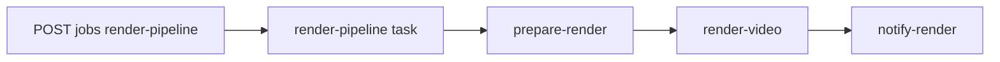

# Inventaire KM — champs utiles pour préparer / rendre (Trigger)

**But** : liste de référence pour ne rien oublier quand `@repo/contracts` et les tasks `apps/trigger` évoluent. **Ce document ne fige pas** le schéma Zod actuel ; il complète le payload minimal existant.

**Contrat JSON actuel** : `RenderPipelinePayloadSchema` dans `@repo/contracts` — `compositionId`, `correlationId` optionnel.

---

## Point d’entrée API vs orchestration interne

L’**API** ne déclenche pas `prepare-render` directement. Elle appelle **`render-pipeline`** :

- Implémentation : [`apps/api/src/lib/triggerRenderPipeline.ts`](../../../apps/api/src/lib/triggerRenderPipeline.ts) — `tasks.trigger("render-pipeline", payload)`.
- La task **`render-pipeline`** ([`apps/trigger/src/trigger/renderPipeline.ts`](../../../apps/trigger/src/trigger/renderPipeline.ts)) :
  1. Parse le payload avec `RenderPipelinePayloadSchema`.
  2. Enchaîne **`prepare-render`** → **`render-video`** → **`notify-render`** via `triggerAndWait` / `unwrap()`.
  3. Retourne `{ prepare, render, notified: true }`.

---

## Chaîne de tasks (détail)

| Niveau | Task id | Rôle | Entrée | Sortie (conceptuelle) |
|--------|---------|------|--------|------------------------|
| **Parent** | `render-pipeline` | Orchestrateur : parse payload, enchaîne les trois étapes | `unknown` → Zod parse | `{ prepare, render, notified: true }` |
| 1 | `prepare-render` | Valider le job, résoudre bundle / métadonnées rendu | `RenderPipelinePayloadDto` | `PrepareRenderOutput` (`compositionId`, `bundleHint`, `correlationId`) |
| 2 | `render-video` | Exécuter le rendu (stub aujourd’hui) | Sortie de prepare | `RenderVideoOutput` (stub + message) |
| 3 | `notify-render` | Propager fin de pipeline (log ; webhook/DB futurs) | `compositionId`, `renderResult`, `correlationId?` | `{ ok: true }` |

---

## Retries et résilience (état du code)

| Task | Bloc `retry` dans le code | Notes |
|------|---------------------------|--------|
| `prepare-render` | Oui — `maxAttempts: 2`, `factor: 2`, `minTimeoutInMs: 500` | Voir [`renderPipeline.ts`](../../../apps/trigger/src/trigger/renderPipeline.ts) |
| `render-video` | Non (défaut SDK / plateforme) | À documenter quand une politique explicite est ajoutée |
| `notify-render` | Non (défaut SDK / plateforme) | Idem |
| `render-pipeline` | Non explicite sur la task parent | Les retries par étape s’appliquent aux sous-tasks déclenchées |

Pour le comportement **checkpoint / long-running** côté Trigger.dev (plateforme), se référer à la doc officielle Trigger et au runbook [api](runbooks/api.md).

---

## Séparation : payload JSON / variables d’environnement / orchestration

| Couche | Contenu | Référence |
|--------|---------|-----------|
| **Payload JSON** (`POST /jobs/render-pipeline`) | `compositionId` (défaut possible selon schéma), `correlationId` optionnel | [`packages/contracts`](../../../packages/contracts/src/index.ts) `RenderPipelinePayloadSchema` |
| **Variables d’environnement** | API : `TRIGGER_SECRET_KEY`, `TRIGGER_API_URL` (requis pour enqueue) ; deploy tasks : `TRIGGER_PROJECT_REF`, CI `TRIGGER_ACCESS_TOKEN` + URL instance | [runbooks/api.md](runbooks/api.md) § Trigger.dev |
| **Orchestration** | Logique `triggerAndWait`, ordre prepare → render → notify, typage `PrepareRenderOutput` / `RenderVideoOutput` | [`renderPipeline.ts`](../../../apps/trigger/src/trigger/renderPipeline.ts) |

Les **secrets** (S3, registry, clés upload) restent en **env** du worker ou de la plateforme — **pas** dans le corps JSON public du job.

---

## Champs utiles à considérer (futur contrat ou env)

| Champ / donnée | Où | Pourquoi |
|----------------|-----|----------|
| `compositionId` | Payload API → Trigger | Id Remotion (`Pilot06PullRequest`, etc.) — **déjà requis** (schéma) |
| `correlationId` | Payload | Traçabilité bout-en-bout, logs — **déjà optionnel** |
| `videoId` ou `slug` catalogue | Payload ou DB lookup | Lier le rendu à `videos` / `video_versions` (seed, catalogue THP) |
| `outputPath` / `renderUrl` cible | prepare ou render | Où écrire le fichier ou enregistrer l’URL après upload |
| `qualityProfile` / résolution / codec | Payload ou config worker | Parité avec runbook rendering (1080p, bitrate) |
| `gitRef` / branche / commit | Payload (optionnel) | Reproducibilité : quel SHA du repo pour le bundle Remotion |
| `idempotencyKey` | Headers ou payload | Éviter doubles rendus pour le même épisode + version |

---

## Lien workflow auteur (compositionId aligné partout)

Pour **chaque** nouvelle composition (pas seulement un pilote donné) :

1. **Id Remotion** : identique à la valeur passée en `compositionId` dans les jobs — enregistré dans [`Root.tsx`](../../../apps/remotion/src/remotion/Root.tsx).
2. **Outline KM** : documenter l’id dans la section implémentation du pilot.
3. **Catalogue web** (si l’épisode est exposé) : `slug` + `compositionId` dans [`packages/db/src/seed.ts`](../../../packages/db/src/seed.ts) et [`sceneRegistry`](../../../apps/frontend/src/sceneRegistry.tsx).

Exemples d’outlines : [pilot-05-merge-outline](../video-ai-preparation/pilot-05-merge-outline.md), [pilot-06-pull-request-outline](../video-ai-preparation/pilot-06-pull-request-outline.md).

---

## Voir aussi

- [video-lifecycle — Architecture and flows (visual index)](video-lifecycle.md#architecture-and-flows-visual-index) — où cette orchestration se place dans le flux global (auteur / exécution / produit).

---

## Mise à jour

Quand un champ est ajouté à `RenderPipelinePayloadSchema`, **mettre à jour** ce fichier pour indiquer « **implémenté** » et pointer vers le commit ou l’ADR si besoin.
