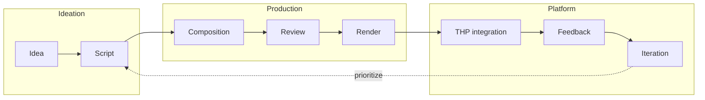

# Video Lifecycle

Reference: full lifecycle of a course video from idea to production and exploitable feedback.

## Lifecycle overview

## Steps

| Step | Description |
|------|-------------|
| **Idea** | Identify need: new lesson, update, or improvement. Linked to THP module/lesson. Design and format: see [video-ai-preparation/](../video-ai-preparation/README.md) (formats, shortlist, pilot outline). |
| **Script** | Outline or script (text, structure). Defines intent before implementation. Write in or link from [video-ai-preparation/](../video-ai-preparation/) (e.g. pilot-outline.md). |
| **Composition** | Implement in Remotion: create or edit composition(s) in this repo. |
| **Review** | Code review + pedagogical review (content, pacing, alignment with course). |
| **Render** | Export video asset(s) (e.g. via Remotion CLI or future rendering pipeline). |
| **THP integration** | Publish asset to platform; link video to course/lesson in THP app. |
| **Feedback** | Collect learner/staff feedback (explicit or inferred) keyed by video/lesson. |
| **Iteration** | Use feedback to prioritize; loop back to script or composition for next version. |

## Who does what

| Role | Main responsibilities |
|------|------------------------|
| **Pedagogy / content** | Idea, script, pedagogical review, prioritization from feedback. |
| **Dev** | Composition implementation, code review, render, integration with THP pipeline. |
| **IA (future)** | Prioritization suggestions, script/scene proposals, assisted edits (v2/v3). |
| **Platform (THP)** | Integration, delivery, feedback storage and exposure to devs. |

## Where it lives in the repo

| Phase | Location | Notes |
|-------|----------|--------|
| Idea / Script / Format design | `KM/Docs/video-ai-preparation/` | Formats (01), component shortlist (02), pilot outline. Write before code. |
| Script | Outside repo or in `KM/` (e.g. course content) | Scripts can live in THP/course docs or in video-ai-preparation/pilot-outline.md. |
| Composition | `apps/remotion/src/remotion/compositions/` | One or more compositions per video/lesson; register in `Root.tsx`. |
| Primitives/blocks | `packages/remotion-lib/src/` | Reusable building blocks used by compositions. |
| Review | PRs, branch workflow | Same as rest of repo; branch per feature/video, PR with code + pedagogical check. |
| Render | CLI today; future runbook `video-ai-rendering.md` | `remotion render` from apps/remotion; batch/ops TBD. |

## See also

- [explanation/video-ai-vision](explanation/video-ai-vision.md) – Long-term vision and v1/v2/v3.
- [runbooks/video-ai-development](runbooks/video-ai-development.md) – Day-to-day development workflow (section 02 links here for lifecycle).
- [runbooks/remotion](runbooks/remotion.md) – Remotion usage and commands.
