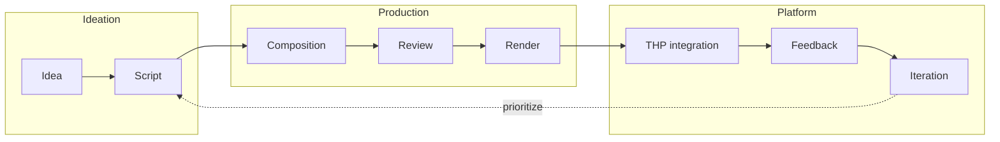

# Video Lifecycle

Reference: full lifecycle of a course video from idea to production and exploitable feedback.

**When to read this / Not for**

- **When to read this**: You need the exact sequence (idea → preparation → components → scene → …), where each step lives in the repo, or who does what.
- **Not for**: Long-term "why" and v1/v2/v3 trajectory → see [video-ai-vision](explanation/video-ai-vision.md).
- **Not for (situation)**: If you're in the middle of debugging a specific Remotion error, go to the [Remotion runbook](runbooks/remotion.md) instead.

**Canonical reference**: If in doubt, this page wins over any summary elsewhere. Other docs may summarize or show variants; this one is the canonical sequence. Links from other docs should point to this page or to sections (anchors) of living docs, not to removed files. When changing file structure, prefer adding anchors and updating links instead of duplicating sections. Example: do not create a separate quick-reference file (e.g. `video-ai-lifecycle-quick.md`); add an anchor or paragraph in this page and link to it.

## Role and audience {#role-and-audience}

- **Role**: Video-AI is the monorepo and tooling used to produce and evolve pedagogical videos for The Hacking Project (THP). Pipeline: Remotion compositions → render → THP platform.
- **Primary audience**: THP learners (web development courses).
- **Secondary**: THP team and contributors who create or improve course videos.
- **Types of videos**: Concept explanations, code demos, recaps (web dev courses).
- **Where used**: Videos are consumed by the THP learning platform; this repo focuses on authoring and rendering the assets.

## Lifecycle overview

## Workflow summary

In practice: **idea** and **script** are prepared in [video-ai-preparation](../video-ai-preparation/video-ai-preparation.md) (formats, shortlist, pilot outline). From the script you derive which **components** to build or reuse (`packages/remotion-lib`), then you assemble the **scene** in `apps/remotion`. After review and render, THP integration and feedback feed **iteration** back to script or composition. On each iteration that touches the script, **re-check** the canonical [pilot-outline template](../Templates/pilot-outline.md) and update the pilot copy so it does not drift from new checklist or metadata requirements.

## Steps

| Step | Description |
|------|-------------|
| **Idea** | Identify need: new lesson, update, or improvement. Linked to THP module/lesson. Design and format: see [video-ai-preparation](../video-ai-preparation/video-ai-preparation.md) (formats, shortlist, pilot outline). |
| **Script** | Outline or script (text, structure). Defines intent before implementation. Write in or link from [video-ai-preparation/](../video-ai-preparation/) (e.g. pilot-outline.md). |
| **Composition** | Script (and pilot outline) drives which components to use or create. Implement or reuse primitives in `packages/remotion-lib`, then assemble the scene in `apps/remotion` (create or edit compositions; register in `Root.tsx`). For step-by-step animated diagrams, keep Mermaid (`.mmd`) as source, generate SVG asset, then animate reveal in Remotion. |
| **Review** | Code review + pedagogical review (content, pacing, alignment with course). |
| **Render** | Export video asset(s) (e.g. via Remotion CLI or future rendering pipeline). |
| **THP integration** | Publish asset to platform; link video to course/lesson in THP app. |
| **Feedback** | Collect learner/staff feedback (explicit or inferred) keyed by video/lesson. |
| **Iteration** | Use feedback to prioritize; loop back to script or composition for next version. **Before** editing script or scene breakdown in a pilot file, sync that file with [Templates/pilot-outline.md](../Templates/pilot-outline.md) if the template changed (see [video-ai-preparation — Template sync before script edits](../video-ai-preparation/video-ai-preparation.md#template-sync-before-script-edits) and [video-ai-development §03b](../runbooks/video-ai-development.md)). |

## Who does what

| Role | Main responsibilities |
|------|------------------------|
| **Pedagogy / content** | Idea, script, pedagogical review, prioritization from feedback. |
| **Dev** | Composition implementation, code review, render, integration with THP pipeline. |
| **IA (future)** | Prioritization suggestions, script/scene proposals, assisted edits (v2/v3). |
| **Platform (THP)** | Integration, delivery, feedback storage and exposure to devs. |

## Where it lives in the repo

| Phase | Location | Notes |
|-------|----------|--------|
| Idea / Script / Format design | `KM/Docs/video-ai-preparation/` | [video-ai-preparation.md](../video-ai-preparation/video-ai-preparation.md) (formats, shortlist, pilot outline). Template: [Templates/pilot-outline.md](../Templates/pilot-outline.md); copy per pilot. Write before code. |
| Script | Outside repo or in `KM/` (e.g. course content) | Scripts can live in THP/course docs or in a copy of the pilot-outline template (from `Templates/`) in video-ai-preparation or elsewhere. |
| Composition | `apps/remotion/src/remotion/compositions/` | One or more compositions per video/lesson; register in `Root.tsx`. |
| Primitives/blocks | `packages/remotion-lib/src/` | Reusable building blocks used by compositions. |
| Review | PRs, branch workflow | Same as rest of repo; branch per feature/video, PR with code + pedagogical check. |
| Render | CLI today; future runbook `video-ai-rendering.md` | `remotion render` from apps/remotion; batch/ops TBD. |

## See also

- [explanation/video-ai-vision](explanation/video-ai-vision.md) – Long-term vision and v1/v2/v3.
- [runbooks/video-ai-development](runbooks/video-ai-development.md) – Day-to-day development workflow (section 02 links here for lifecycle).
- [runbooks/remotion](runbooks/remotion.md) – Remotion usage and commands.
